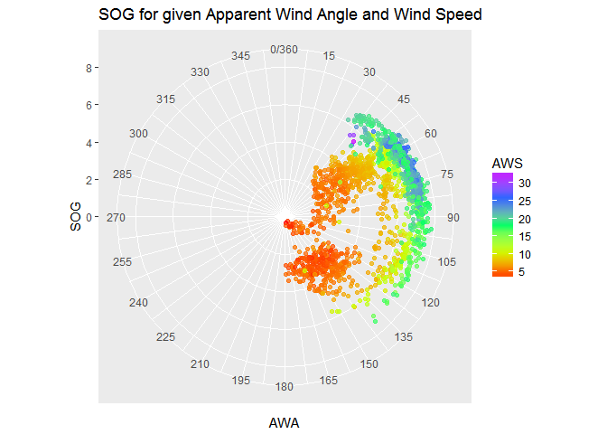
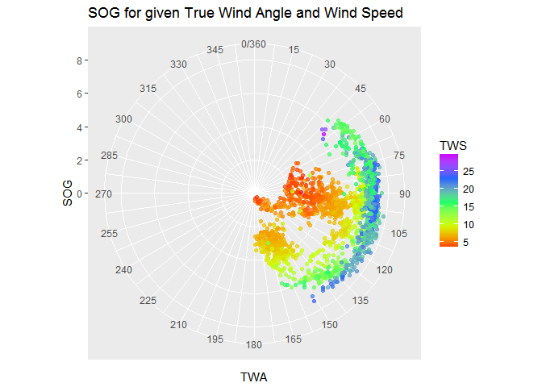
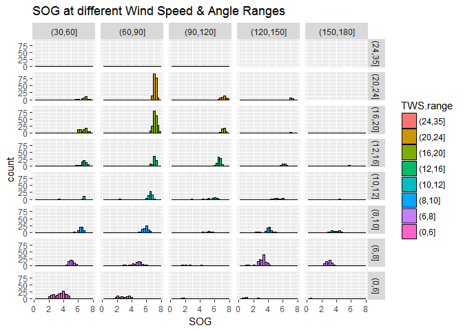
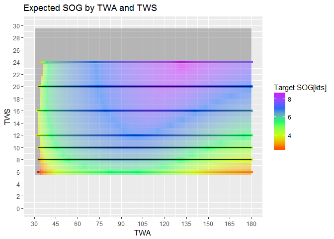
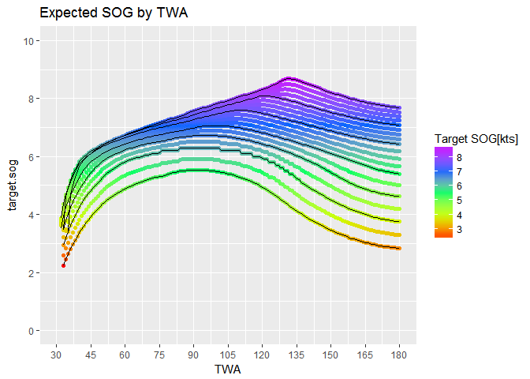
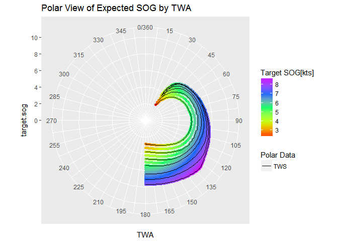
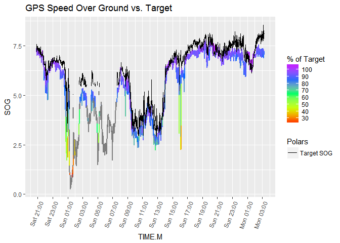

BYCMACK2017 Zubenelgenubi Performance
================

Our Route
=========

Unfortunately, the first battery ran out around 8pm on Saturday night. So, I could only capture from Harbor Beach to just before finish.

The replacement battery ran (26800 mah) for 31 hrs, so total draw was around 0.8 amps.


Wind Condition During Race
--------------------------


Boat Performance
================

 Looking at the wind, we can see our wind speed dropped dramatically during this middle leg.

 We can see here that are speeds vary much more at lower wind speeds and when beating. Not too suprising.

Performance VS Polars
=====================

### Polar Model (using linear interpolation)

I used a simple linear interpolation between points to estimate our target speed at a given TWS and TWA. Any grey points are outside of the model and could not be estimated.

The below three graphs just show different views of the polar model. 

    ## [1] "The black lines are the data values provided by ORA"



Observed Performance
--------------------

Our actual performance versus the polar.

In general it seems like we did pretty well to our polars. The biggest defficiencies were at slower speeds under 10 kts. Not too suprising.

Unforatunately, about 20% of the data couldn't be estimated by the model. I'm working on this.

We averaged 93.67% of our polar. A reasonable target is 95%.





    ## [1] "Mean Performance =  93.67 %"


Calculation of Optimal finish time given same wind condition and course
=======================================================================

``` r
mean.target.speed <- mean(perf$target.SOG, na.rm = TRUE)

rhumb.length <- 205  #in NM

estimated.elapsed <- rhumb.length / mean.target.speed

paste("Optimal elapsed time", round(estimated.elapsed, 2), "hrs")  
```

    ## [1] "Optimal elapsed time 32.21 hrs"

``` r
#actual estimated time 
actual.elapsed <- 38 + 52/60 + 24/3600


#time loss due under target
paste("Time Diff between actual and optimal", round(actual.elapsed - estimated.elapsed, 2), "hrs")
```

    ## [1] "Time Diff between actual and optimal 6.66 hrs"

``` r
#corrected time
orr <- .721

paste("Corrected Optimal Time", round((estimated.elapsed * orr), 2), "hrs")
```

    ## [1] "Corrected Optimal Time 23.22 hrs"

A corrected time of 23.22 would put us 4th in Section N and 10th in DII overall.
